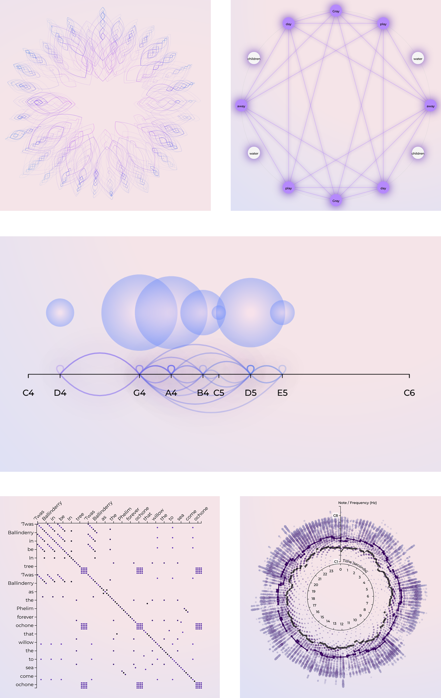

# 🎶 MSc Thesis - Visualization of Folk Songs

This dissertation project was completed as part of the Master's degree program in Design and Multimedia at the University of Coimbra's Department of Computer Engineering.

🔗 Check out the resulting website here: https://msc-thesis-lilac.vercel.app/

## Examples

  

## 🏷️ Keywords

Information Visualization, Casual Visualization, Folk Music, Interactivity

## 📄 Abstract

The past five decades have witnessed extraordinary advancements in the field
of computing, resulting in the current technological paradigm. These advancements
have permeated diverse domains of knowledge, particularly music, which
has witnessed novel methods of transmission and dissemination of information.

However, due to technological progress, the dissemination of popular music from
the oral tradition has declined. This musical genre is linked to the cultural identity
of communities, profoundly impacting the formation of individuals. Consequently,
we urgently need to equip ourselves with the necessary interactive
graphic tools to assist in the preservation and dissemination of folk traditions.

The goal of this dissertation project is to develop interactive information visualization techniques for folk music. These visualizations are intended to communicate and disseminate interesting patterns inherent in musical data. Specifically, the project intends to create visualizations of folk music pieces focusing on the intersection of various components: the **score, lyrics, and sound characteristics.**

## ⚙️ Tools 

- [D3](https://d3js.org/)
- [React](https://react.dev/)
- [MUI Material UI](https://mui.com/)
- [Vite Build Tool](https://vite.dev/)
- [React Spinners by Davud Hu](https://www.davidhu.io/react-spinners/)
- [Vercel](https://vercel.com/home)

## 📦 Dependencies

    "dependencies": {
    "@emotion/react": "^11.14.0",
    "@emotion/styled": "^11.14.0",
    "@mui/base": "^5.0.0-beta.70",
    "@mui/icons-material": "^7.1.1",
    "@mui/material": "^7.1.1",
    "@rollup/plugin-dsv": "^3.0.5",
    "d3": "^7.9.0",
    "node": "^22.17.0",
    "react": "^18.3.1",
    "react-dom": "^18.3.1",
    "react-spinners": "^0.17.0"
  },
  
## 👩‍💻 Run this repo locally

    cd app
    npm run dev